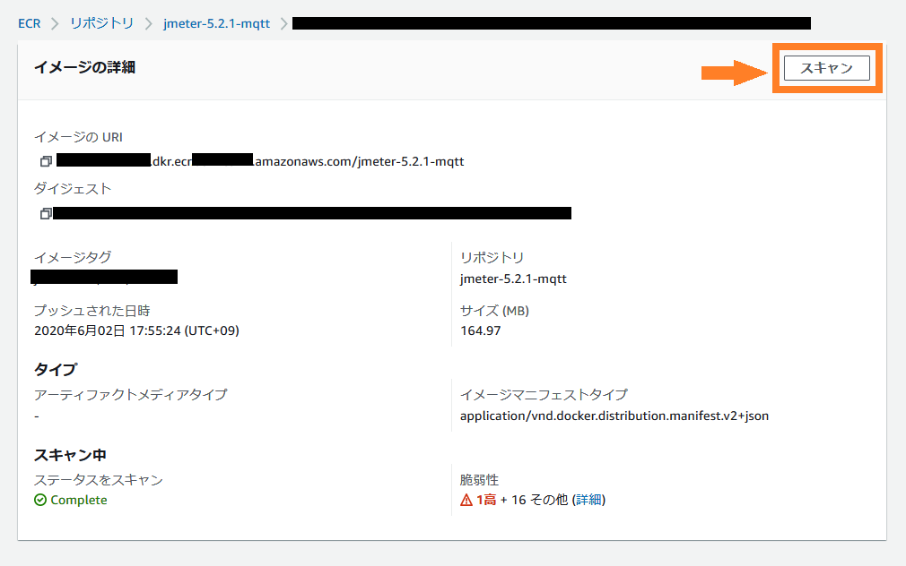
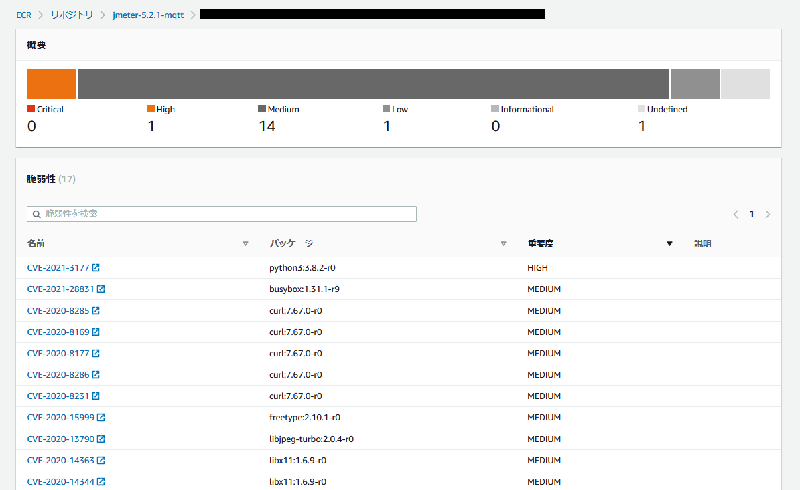

# コンテナイメージを自動で脆弱性スキャンするCI/CD

<ScreenTransitionBtn btnName="戻る" />

IPAの[脆弱性対応ガイドライン](https://www.ipa.go.jp/security/ciadr/partnership_guide.html)より、サイバーセキュリティの現状が述べられています。

> 2000 年頃より、日本国内においてソフトウエアやウェブアプリケーションの脆弱性が発見されることが増えており、これらの脆弱性を悪用した不正アクセス行為やコンピュータウイルスの増加により、企業活動が停止したり情報資産が滅失したり個人情報が漏えいしたりといった、重大な被害が生じています。

上記のような被害を未然に防ぐため、ソフトウェアやアプリケーションの脆弱性を検出できる環境が必要になります。本ナレッジでは、コンテナを扱うケースを例に、脆弱性を検出するツールや、継続的に検出可能な CI/CD 環境について紹介します。

___

[[toc]]

___

## 用語集

|      用語       |                  正式名称                   |                                       意味                                        |
| :-------------- | :------------------------------------------ | :-------------------------------------------------------------------------------- |
| CI/CD           | Continuous Integration／Continuous Delivery | ソフトウェアを自動でテストし自動でデプロイする開発手法/環境のこと。               |
| CISベンチマーク | Center for Internet Security Benchmark      | CISが提供するベストプラクティス。本ナレッジではCISベンチマーク for Dockerを指す。 |
| CVE             | Common Vulnerabilities and Exposures        | 脆弱性に対して共通の識別子を付与したリストのこと                                  |
| NVD             | National Vulnerability Database             | NIST(アメリカ国立標準技術研究所)が提供する脆弱性のデータベースのこと              |

## 脆弱性スキャンのメリット

- コンテナのセキュリティを向上できる
    - 外部から攻撃/侵入される余地が少なくなります。
    - 攻撃/侵入する方法を探られにくくなります。
- 脆弱性の脅威レベルや原因が把握できる
    - それぞれの脆弱性に対して脅威レベルが定められているため、脆弱性の対策の順番を定めやすくなります。
    - 脆弱性の原因と対策方法が具体的に指摘されるため、修正が容易です。

## 脆弱性の主な検出基準

- [Dockerベストプラクティス](https://docs.docker.jp/develop/develop-images/dockerfile_best-practices.html)
    - コンテナを定義する際に、適切な書き方を提示しています。
    - ベストプラクティスに沿わない場合、コンテナに脆弱性が含まれる可能性があります。
- [共通脆弱性識別子CVE](https://www.ipa.go.jp/security/vuln/CVE.html)
    - 外部のライブラリやOSが脆弱性を含んでいる場合、CVEが割り当てられます。
    - 該当するライブラリやOSを使用している場合、そのコンテナは脆弱性が含まれています。
    - CVEは脆弱性データベース(NVDなど)から取得でき、該当するバージョンや脆弱性の詳細な情報が得られます。

## 代表的なコンテナ脆弱性スキャンツールの紹介

本ナレッジでは [Homebrew](https://docs.brew.sh/Homebrew-on-Linux) (`brew`)を使用したインストール方法のみを記載します。その他のインストール方法は各スキャンツールからインストール方法をご確認ください。

### [Hadolint](https://github.com/hadolint/hadolint)

Docker公式が出しているベストプラクティスを元に、Dockerfileを検査します（引用元のイメージは検査しない）。 Dockerfile内に記載されているshellスクリプトは`shellcheck`を使用してスキャンします。

- スキャン対象　：Dockerfile
- 検査基準　　　：Dockerベストプラクティス、[shellcheck](https://github.com/koalaman/shellcheck)
- 検出ルール　　：[Hadolint Rules](https://github.com/hadolint/hadolint#rules)
- 脅威レベル分類： 高: `error`, 中: `warning`, 低: `info`

#### 使用方法

```shell
$ brew install hadolint
$ hadolint /path/to/dir/Dockerfile
```

**検出ログのサンプル**

```
container/jmeter/Dockerfile:15 DL3047 warning: Avoid use of wget without progress bar. Use `wget --progress=dot:giga <url>`.Or consider using `-q` or `-nv` (shorthands for `--quiet` or `--no-verbose`).
container/jmeter/Dockerfile:15 DL3017 error: Do not use apk upgrade
container/jmeter/Dockerfile:15 DL4001 warning: Either use Wget or Curl but not both
container/jmeter/Dockerfile:15 DL3019 info: Use the `--no-cache` switch to avoid the need to use `--update` and remove `/var/cache/apk/*` when done installing packages
container/jmeter/Dockerfile:15 DL3018 warning: Pin versions in apk add. Instead of `apk add <package>` use `apk add <package>=<version>`
```

### [Dockle](https://github.com/goodwithtech/dockle)

DockerのベストプラクティスとCISベンチマークに加え、Dockle独自のルールに沿っているコンテナイメージであるか検査します。元のイメージに含まれる脆弱性も検出します。外部のライブラリやOSは検出対象にはなりません。

- スキャン対象　：コンテナイメージ
- 検査基準　　　：Dockerベストプラクティス、CISベンチマーク
- 検出ルール　　：[Dockle Checkpoint](https://github.com/goodwithtech/dockle/blob/master/CHECKPOINT.md)
- 脅威レベル分類： 高: `FATAL`, 中: `WARN`, 低: `INFO`

#### 使用方法

```shell
$ brew install dockle
$ dockle target_image_name:tag_name
```

**検出ログのサンプル**

```
FATAL	- DKL-DI-0003: Avoid apt-get/apk/dist-upgrade
	* Avoid upgrade in container : |2 JMETER_VERSION=5.2.1 TZ=Asia/Tokyo /bin/sh -c apk update 	&& apk upgrade 	&& apk add ca-certificates 	&& update-ca-certificates 	&& apk add --update openjdk8-jre tzdata curl unzip bash 	&& apk add --no-cache nss 	&& rm -rf /var/cache/apk/* 	&& mkdir -p /tmp/dependencies  	&& curl -L --silent ${JMETER_DOWNLOAD_URL} >  /tmp/dependencies/apache-jmeter-${JMETER_VERSION}.tgz  	&& mkdir -p /opt  	&& tar -xzf /tmp/dependencies/apache-jmeter-${JMETER_VERSION}.tgz -C /opt  	&& rm -rf /tmp/dependencies     && wget -O ${JMETER_HOME}/lib/ext/mqtt-xmeter-1.13.jar "emqx/mqtt-jmeter@master/Download/v1.13.0/mqtt-xmeter-1.13-jar-with-dependencies.jar?raw=true"
WARN	- CIS-DI-0001: Create a user for the container
	* Last user should not be root
INFO	- CIS-DI-0006: Add HEALTHCHECK instruction to the container image
	* not found HEALTHCHECK statement
```

### [Docker Bench for Security](https://github.com/docker/docker-bench-security)

Docker公式のベンチマークツール。CISのベンチマークをベースにDockerのベストプラクティスに沿っているコンテナイメージか検査します。複数のイメージを同時にスキャン可能です。

- スキャン対象　：コンテナイメージ
- 検査基準　　　：Dockerベストプラクティス、CISベンチマーク
- 検出ルール　　：[Docker Bench Available Checks](https://github.com/docker/docker-bench-security/blob/master/tests/TESTS.md)
- 脅威レベル分類： 高: `WARN`, 中: `NOTE`, 低: `INFO`

#### 使用方法

```shell
$ docker run --rm --net host --pid host --userns host --cap-add audit_control \
    -e DOCKER_CONTENT_TRUST=$DOCKER_CONTENT_TRUST \
    -v /etc:/etc:ro \
    -v /usr/bin/containerd:/usr/bin/containerd:ro \
    -v /usr/bin/runc:/usr/bin/runc:ro \
    -v /usr/lib/systemd:/usr/lib/systemd:ro \
    -v /var/lib:/var/lib:ro \
    -v /var/run/docker.sock:/var/run/docker.sock:ro \
    --label docker_bench_security \
    -t target_image_name:tag_name \
    docker/docker-bench-security
```

**検出ログのサンプル**

```
[INFO] 4 - Container Images and Build File
[INFO] 4.1  - Ensure a user for the container has been created
[INFO]      * No containers running
[NOTE] 4.2  - Ensure that containers use trusted base images
[NOTE] 4.3  - Ensure unnecessary packages are not installed in the container
[NOTE] 4.4  - Ensure images are scanned and rebuilt to include security patches
[WARN] 4.5  - Ensure Content trust for Docker is Enabled
[WARN] 4.6  - Ensure HEALTHCHECK instructions have been added to the container image
.
.
.
```

### [Trivy](https://github.com/aquasecurity/trivy)

NVDから得た脆弱性を元に、コンテナイメージに脆弱性が含まれているライブラリやOSが使用されているか検出します。アプリケーションと依存関係にあるパッケージも含めて検出することができます。

- スキャン対象　：コンテナイメージ
- 検査基準　　　：NVD(脆弱性データベース)
- 脅威レベル分類： 重大: `CRITICAL`, 高: `HIGH`, 中: `MEDIUM`, 低: `LOW`, 不明: `UNKNOWN`

#### 使用方法

```shell
$ brew install trivy
$ trivy image target_image_name:tag_name
```

**検出ログのサンプル**

```
jmeter_jmeter:latest (alpine 3.11.5)
====================================
Total: 19 (UNKNOWN: 1, LOW: 2, MEDIUM: 8, HIGH: 8, CRITICAL: 0)

+--------------+------------------+----------+-------------------+---------------+---------------------------------------+
|   LIBRARY    | VULNERABILITY ID | SEVERITY | INSTALLED VERSION | FIXED VERSION |                 TITLE                 |
+--------------+------------------+----------+-------------------+---------------+---------------------------------------+
| apk-tools    | CVE-2021-30139   | UNKNOWN  | 2.10.4-r3         | 2.10.6-r0     | -->avd.aquasec.com/nvd/cve-2021-30139 |
+--------------+------------------+----------+-------------------+---------------+---------------------------------------+
| busybox      | CVE-2021-28831   | HIGH     | 1.31.1-r9         | 1.31.1-r10    | busybox: invalid free or segmentation |
|              |                  |          |                   |               | fault via malformed gzip data         |
|              |                  |          |                   |               | -->avd.aquasec.com/nvd/cve-2021-28831 |
+--------------+------------------+          +-------------------+---------------+---------------------------------------+
| libcrypto1.1 | CVE-2020-1967    |          | 1.1.1d-r3         | 1.1.1g-r0     | openssl: Segmentation                 |
|              |                  |          |                   |               | fault in SSL_check_chain              |
|              |                  |          |                   |               | causes denial of service              |
|              |                  |          |                   |               | -->avd.aquasec.com/nvd/cve-2020-1967  |
+              +------------------+          +                   +---------------+---------------------------------------+
|              | CVE-2021-23840   |          |                   | 1.1.1j-r0     | openssl: integer                      |
|              |                  |          |                   |               | overflow in CipherUpdate              |
|              |                  |          |                   |               | -->avd.aquasec.com/nvd/cve-2021-23840 |
+              +------------------+----------+                   +---------------+---------------------------------------+
|              | CVE-2020-1971    | MEDIUM   |                   | 1.1.1i-r0     | openssl: EDIPARTYNAME                 |
|              |                  |          |                   |               | NULL pointer de-reference             |
|              |                  |          |                   |               | -->avd.aquasec.com/nvd/cve-2020-1971  |
.              .                  .          .                   .               .                                       .
.              .                  .          .                   .               .                                       .
.              .                  .          .                   .               .                                       .

```

### [Clair](https://github.com/quay/clair)

NVDから得た脆弱性を元に、コンテナイメージに脆弱性が含まれているライブラリやOSが使用されているか検出します。パッケージ管理ツールを使わずにインストール(curlやwgetなど)した場合、そのパッケージは検査の対象になりません。 AWSのECRのリポジトリの公式スキャンツールに採用されており、ワンクリックでスキャンを実行できます。

- スキャン対象　：コンテナイメージ
- 検査基準　　　：NVD(脆弱性データベース)
- 脅威レベル分類： 重大: `Critical`, 高: `High`, 中: `Medium`, 低: `Low`, 備考: `informational`, 不明: `Undefined`

#### 使用方法

**AWS ECRでスキャンする方法**

- AWSコンソールのECRのリポジトリページから、各イメージのタグページに移動し、スキャンを押す



**検出ログのサンプル**



### 各スキャンツールの比較

|              |                Hadolint                |                                 Dockle                                  |              Docker Bench for Security              |                                  Trivy                                   |              Clair               |
| :----------: | -------------------------------------- | ----------------------------------------------------------------------- | --------------------------------------------------- | ------------------------------------------------------------------------ | -------------------------------- |
| スキャン対象 | Dockerfile                             | コンテナイメージ                                                        | コンテナイメージ                                    | コンテナイメージ                                                         | コンテナイメージ                 |
|   検査基準   | Dockerベストプラクティス<br>shellcheck | Dockerベストプラクティス<br>CISベンチマーク<br>Dockle独自ルール | Dockerベストプラクティス<br>CISベンチマーク | NVD                                                                      | NVD                              |
|   対象範囲   | Dockerfile記法                         | コンテナイメージ                                                        | コンテナイメージ                                    | OS<br>インストールしたパッケージ<br>アプリケーションが使用するパッケージ | OS<br>インストールしたパッケージ |

___

## コンテナを自動でスキャンするワークフローの紹介

今回、例としてコンテナをスキャンするツールに、`Hadolint`, `Dockle`, `Trivy`の3つを使います。CI/CDのツールは`GitHub Actions`を利用します。

このワークフローは、マージの前に脆弱性のスキャンを行い、問題ないコンテナであるかチェックすることができます。スキャンを通過できない場合、本流のブランチへマージできないよう制御することもできます。

**ワークフローのおおまかな仕様**

- プルリクエストを作成したとき動作する
    - 以下のフォルダが更新されたとき動作する
    - `container/`フォルダ
    - `.github/workflows`フォルダ
- `Hadolint`, `Dockle`, `Trivy`を動かす
    - 3つのツールを並列で動作させる
- 結果を出力する
    - 結果をslackに通知する
    - 出力ファイルをGitHubActionsのアーティファクトに保存する
    - 脆弱性が検出されたときにNG判定になる

**ソースコード全体**

::: details GitHub Actionsワークフローのソースコードはこちら

フォルダ構成

```javascript
root
├ .github/workflows
│   └ ContainerScan.yml    // コンテナスキャンのワークフロー
└ container
    └ web_server
        └ Dockerfile       // スキャン対象のコンテナのDockerfile
```

ワークフロー

```yaml
# ContainerScan.yml
name: Check docker image 

on:
  pull_request:
    branches:
      - dev
    paths:
      - 'container/**'
      - '.github/workflows/**'

jobs:
  deploy:
    name: scan and lint
    runs-on: ubuntu-latest
    env:
      IMAGE_REF: "web_server:test"
      RESULT_DIR: "result"
      TARGET_CONTAINER: "container/web_server"
    steps:
      - uses: actions/checkout@v2
      - name: Build container
        run: |
          docker build -t $IMAGE_REF $TARGET_CONTAINER
      - name: Set up Homebrew
        id: set-up-homebrew
        uses: Homebrew/actions/setup-homebrew@master
      - name: Setup hadolint, dockle, trivy
        run: |
          mkdir $RESULT_DIR
          brew install hadolint goodwithtech/r/dockle aquasecurity/trivy/trivy

      - name: Exec hadolint, dockle, trivy
        run: |
          hadolint $TARGET_CONTAINER/Dockerfile --no-fail > $RESULT_DIR/hadolint.log &
          dockle --exit-code 0 $IMAGE_REF > $RESULT_DIR/dockle.log &
          trivy image --exit-code 0 $IMAGE_REF > $RESULT_DIR/trivy.log &
          wait
      - name: Upload to artifact
        uses: actions/upload-artifact@v2
        with:
          name: logs
          path: ${{ env.RESULT_DIR }}/*.log
      - name: Show Scan Logs
        run: |
          cat $RESULT_DIR/hadolint.log
          cat $RESULT_DIR/dockle.log
          cat $RESULT_DIR/trivy.log
      - name: Check fatal-error
        id: fatal-checker
        run: |
          hado_err=$(grep -c error output/hadolint.log)
          hado_warn=$(grep -c warning output/hadolint.log)
          dockle_err=$(grep -c FATAL output/dockle.log)
          dockle_warn=$(grep -c WARN output/dockle.log)
          trivy_fatal=$(grep -o -e "CRITICAL: [0-9]*" output/trivy.log | awk '{print $ 2;}')
          trivy_err=$(grep -o -e "HIGH: [0-9]*" output/trivy.log | awk '{print $ 2;}')
          trivy_warn=$(grep -o -e "MEDIUM: [0-9]*" output/trivy.log | awk '{print $ 2;}')

          if  [ $hado_err -eq 0 ] && [ $hado_warn -eq 0 ]\
           && [ $dockle_err -eq 0 ] && [ $dockle_warn -eq 0 ]\
           && [ $trivy_fatal -eq 0 ] && [ $trivy_err -eq 0 ] && [ $trivy_warn -eq 0 ]\
            ; then
              exit 0
          else
              exit 1
          fi
```

:::

### ソースコードの解説

上記のGitHub Actionsワークフローから、主にコンテナの脆弱性スキャンに関わる箇所のソースコードについて解説します。GitHub Actions特有の記述については、本ナレッジでは割愛します。

#### 3つのスキャンツールの実行

`Hadolint`, `Dockle`, `Trivy`をそれぞれ実行し、ログファイルに出力します。

- `hadolint`, `dockle`, `trivy`を実行します。スキャン対象については、`Dockerfile`やコンテナイメージ名`$IMAGE_REF`を指定します。
- それぞれのスキャン実行時に、`>`のリダイレクトで`/output/xxxxxx.log`にスキャン結果を出力します。
- スキャン実行の最後に`&`を書くことで並列に動作させることができます。

```yaml{3-6}
      - name: Exec hadolint, dockle, trivy
        run: |
          hadolint $TARGET_CONTAINER/Dockerfile --no-fail > $RESULT_DIR/hadolint.log &
          dockle --exit-code 0 $IMAGE_REF > $RESULT_DIR/dockle.log &
          trivy image --exit-code 0 $IMAGE_REF > $RESULT_DIR/trivy.log &
          wait
```

#### スキャン結果を分析する

`Hadolint`, `Dockle`, `Trivy`からそれぞれ脆弱性の数を出力し、OK/NGか判断します。

- `Hadolint`, `Dockle`の場合
    - 1行毎に脆弱性がリスト化されているため、`grep -c`を利用し、脅威度の単語が含まれている行数をカウントします。
- `Trivy`の場合
    - ログの頭にサマリーが存在するため、`grep -o -e`でサマリーから`HIGH: 24`の形式で文字列を抽出します。
    - `HIGH: 24`の文字列から、`awk '{print $ 2;}'`で、文字列の右側にある数字だけ取り出します。
- それぞれの数値を元に、スキャンがOKかNGか判断します。

```yaml{4,8}
      - name: Check fatal-error
        id: fatal-checker
        run: |
          hado_err=$(grep -c error output/hadolint.log)
          hado_warn=$(grep -c warning output/hadolint.log)
          dockle_err=$(grep -c FATAL output/dockle.log)
          dockle_warn=$(grep -c WARN output/dockle.log)
          trivy_fatal=$(grep -o -e "CRITICAL: [0-9]*" output/trivy.log | awk '{print $ 2;}')
          trivy_err=$(grep -o -e "HIGH: [0-9]*" output/trivy.log | awk '{print $ 2;}')
          trivy_warn=$(grep -o -e "MEDIUM: [0-9]*" output/trivy.log | awk '{print $ 2;}')

          if  [ $hado_err -eq 0 ] && [ $hado_warn -eq 0 ]\
           && [ $dockle_err -eq 0 ] && [ $dockle_warn -eq 0 ]\
           && [ $trivy_fatal -eq 0 ] && [ $trivy_err -eq 0 ] && [ $trivy_warn -eq 0 ]\
            ; then
              exit 0
          else
              exit 1
          fi
```

## まとめ

スキャンツールを使うことで、セキュリティの問題を可視化し対処しやすくなりました。
また、スキャンツールとCI/CDを組み合わせることで、自動でスキャンを実施したり、新しくリリースするソフトウェアに対してスキャンを徹底することができました。

本ナレッジはリリース前のスキャンを例にしましたが、リリース後にも定期スキャンを行うことでよりセキュリティを高めることも可能です。
例えば、今回の方法の派生として以下のようなスキャンを行うこともできます。

- ワークフローをスケジュール起動させ、定期的にビルドとスキャンを行う。
- Clair on ECRを定期的に起動させ、プッシュ済みイメージのスキャンを行う。

プロジェクトに対して必要なツールと実行タイミングを選択し、セキュリティ要件を満たしたCI/CDの構築をおすすめします。
