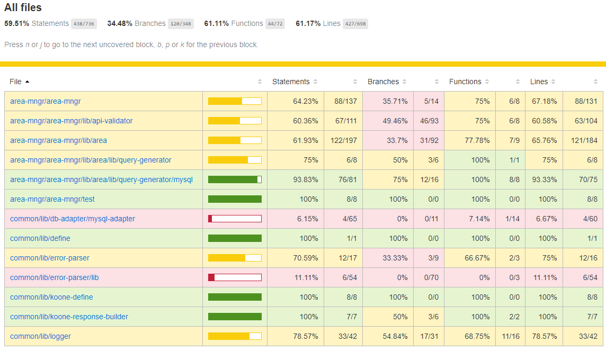
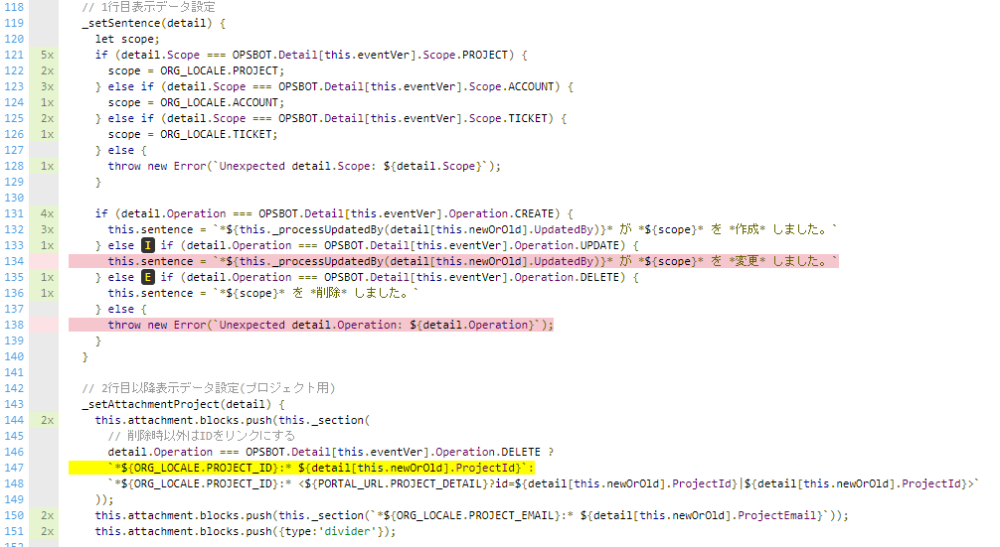
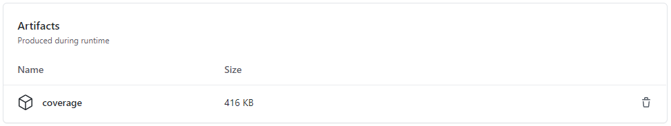
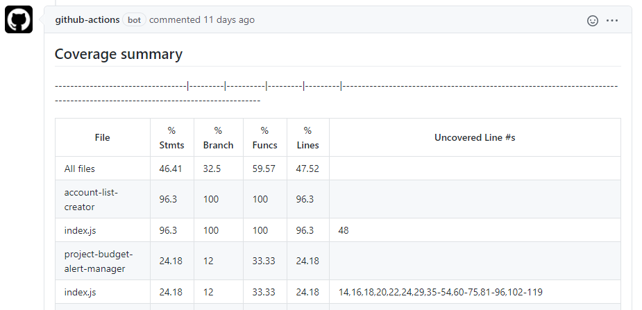
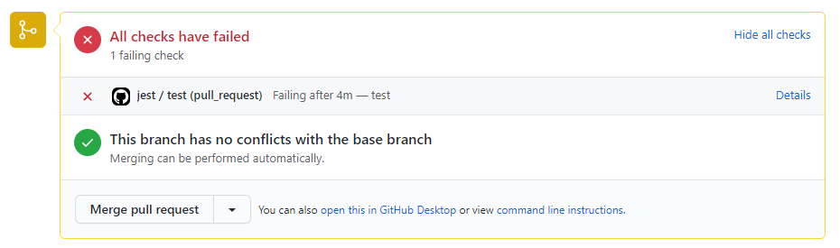

# Jestを利用したテスト自動化環境の構築

<ScreenTransitionBtn btnName="戻る" />


ソフトウェアの品質を損なわないためにテストは必要ですが、規模が大きくなってくると大量のテストをしないといけませんし、人間が頑張ってやるとミスも起きます。テストを自動化することは、正確さと効率化において重要です。また、テスト自動化環境を構築することで、機能追加による副作用が評価でき、継続的改善が可能となります。

このナレッジでは、JavaScriptのためのテストフレームワークである**Jest**を利用したテスト自動化の方法を紹介します。

___

[[toc]]

___

## 概要
### 単体テスト（ユニットテスト）

単体テストとは、プログラムをモジュール（いくつかの部品）ごとに分けて考えて、「モジュールが単体できちんと動作しているか」を確かめる作業になります。モジュールは基本的に関数やクラスといった単位でまとまっています。

### 単体テストの自動化

単体テストは自動化することでより高い効果を期待できます。自動化することで、多数のテストケースを漏れなく確実に実行できます。また、定期的にテストケースを実行することで、コードの変更によって既存のコードの動作にエラーが起きていないか、デグレードの有無を確認できます。
テスト自動化にはテストフレームワークを使用します。入力に対するモジュールの期待動作をテストケースとしてあらかじめ記述しておき、それを自動的に実行するテストフレームワークにテストを任せます。テストフレームワークは、テストを通過したかどうか、どのテストが落ちたか、ソースコードの網羅率は、などの様々な情報を出力します。テストケースは普通のプログラムの形で記述し、自力で作成する必要があるので、テストケース自体にバグを含めないよう注意が必要です。

### Jestとは
JestとはFacebook社がオープンソースとして開発しているJavaScriptのためのテストフレームワークです。
ユニットテストツールとしてはJest以外にも以下のようなツールがありますが、Jestはこれらの機能をオールインワンで提供しているので、導入の負担が低いのが魅力です。
|分類   |概要   | 例  |
| ------------ | ------------ | ------------ |
|テストランナー   |テスト実行環境、検証結果のレポート機能などを提供   |[Karma](https://karma-runner.github.io/latest/index.html "Karma")   |
| コアフレームワーク  | **describe**、 **it** などテストの構造を作る機能を提供  | [Mocha](https://mochajs.org/ "Mocha")  |
| アサーション  | テスト結果が期待通りであるか判定する機能を提供  |[Chai](https://www.chaijs.com/ "Chai")   |
| テストユーティリティ  | モック、スタブなどの機能を提供  | [Sinon](https://sinonjs.org/ "Sinon")  |

## Jest導入
Jestの導入について説明します。以降では、`Node.js`、`GitHub Actions`について、ある程度の知識があること前提としています。
### 前提条件
- Node.jsとnpmがインストール済みであること。
  > 記事執筆時に使用していたバージョンはNode.js`12.14.1`、npm`6.13.4`です。

### インストール
必要なものは`jest`パッケージのみです。下記コマンドでnpmから入手します。
> 記事執筆時に使用していたJestのバージョンは`26.6.3`です。

```sh
$ npm install --save-dev jest
```
`npm test`で実行できるように`package.json`に下記のように追加します。
```json
{
  "scripts": {
    "test": "jest"
  },
}
```
### 設定
設定ファイルが無くても動きますが、設定で挙動をカスタマイズできます。
- jest.config.jsファイルをプロジェクト直下に作成するか、package.jsonのjestフィールドにJSONで追記します。  
設定ファイルの詳細オプションは[公式ガイド](https://jestjs.io/ja/docs/configuration)を参照してください。

```javascript
// jest.config.js
module.exports = {
  verbose: true
}
```
```json
// pacage.json
{
  "name": "my-project",
  "jest": { // <-- jestプロパティ以下に設定を書く
    "verbose": true
  }
}
```

### ディレクトリ構成例
シンプルなディレクトリ構成は以下のようになります。[テストコードの実装](/knowledge/items/jest/#テストコードの実装) で説明しますが、テスト実行対象ファイルはプロジェクト配下のどこにあっても構わないので、モジュール毎にディレクトリを作成してソースコード（`sample.js`）とテストコード（`sample.test.js`）を配置してもよいです。
  ```
  .
  |── node_modules
  |── package.json
  |── package-lock.json
  |── sample.js              // テスト対象ファイル
  |── sample.test.js         // テストコード記述ファイル
  └── jest.config.js         // Jest設定ファイル
  ```

### 使用方法
Jestの基本的な使用方法を説明します。  
詳細は**jest**の[公式ガイド](https://jestjs.io/ja/docs/getting-started)を参照してください。
#### テストコードの実装
- テスト実行対象ファイル
  - `.test.js`ファイルを作成し、テストコードを記述します。

  - テスト実行対象ファイルは設定ファイル、またはCLIのオプションでも指定可能です。
  - デフォルトではプロジェクトルート配下の全てのディレクトリにある `.spec.js` or `.test.js` ファイルがテスト実行対象となります。
- テスト記述
  - [test関数](https://jestjs.io/ja/docs/api#testname-fn-timeout)にテストを記述します。
  - [expect関数](https://jestjs.io/docs/ja/expect)で期待動作を記述します。
  - expect関数では[matcher](https://jestjs.io/docs/ja/using-matchers)を使用して、値のテストを行います。
  - [describe関数](https://jestjs.io/docs/ja/api#describename-fn)でテスト対象をカテゴライズします。
- 簡単なテスト記述例
  - 2つの数値を加算、減算する関数を含む`sample.js`ファイルをテスト対象とします。
  ```javascript
  // sample.js
  exports.sum = (a, b) => {
    return a + b;
  };
  exports.diff = (a, b) => {
    return a - b;
  };
  ```
  - `sample.test.js`ファイルにテストコードを記述します。
  ```javascript
  // sample.test.js
  const sample = require('./sample');

  describe('sample test', () => {
    test('[sum] 1 + 2 = 3', () => {
      expect(sample.sum(1, 2)).toBe(3);     // toBe()はmatcher
    });
    test('[diff] 5 - 2 = 3', () => {
      expect(sample.diff(5, 2)).toBe(3);    // toBe()はmatcher
    });
  });
  ```

#### テスト実行
以下のコマンドで実行します。
```sh
$ npm test
``` 
テストが実行されて結果が表示されます。
```sh
PASS sample/sample.test.js
  sample test
    √ [sum] 1 + 2 = 3 (2 ms)
    √ [diff] 5 - 2 = 3 (1 ms)

Test Suites: 1 passed, 1 total
Tests:       2 passed, 2 total
Snapshots:   0 total
Time:        2.184 s
Ran all test suites matching /sample/i.
```
`coverage`オプションを使用するとカバレッジレポートが取得できます。
```sh
$ npm test -- --coverage
```
出力された`coverage`フォルダ内の`index.html`を開くと以下のようなレポートが表示されます。


ファイル名をクリックすることで各ファイルのテスト未実施の条件やパスが色分けして表示されます。


`t` オプションで`describe`に指定した文字列が含まれるテストのみ実施することもできます。

```sh
$ npm test -- --t [unit]
```
CLIで指定できるオプションの一覧は[公式ガイド](https://jestjs.io/docs/cli)を参照してください。

## 自動でJestを実行する
[Github Actions](https://docs.github.com/ja/actions/learn-github-actions)を利用して、自動でテストを実行する方法を紹介します。`Github Actions`についてや、ワークフロー定義ファイルの記述方法などの詳細は本ナレッジでは割愛します。

### 前提条件
- テストコードが実装済みであること。
- リポジトリ直下の`pacage.json`の`dependencies`に`jest`パッケージが書かれていること。
- jestの設定がある場合は、リポジトリ直下に`jest.config.js`を置くか、`package.json`の`jestフィールド`に追記してあること。

### ワークフロー概要
- プルリクエスト作成時、または、そのプルリクエストにプッシュ時に単体テスト(Jest)を実行します。
- カバレッジレポートファイルをアーティファクトとして保存します。
- プルリクエストのコメントにカバレッジレポートサマリーを表示します。

### ワークフロー定義ファイル
次のような内容のワークフロー定義ファイルを`.github/workflows/`に置きます。

::: details ワークフロー定義ファイル
```yaml
name: jest
on:
  pull_request:
    branches:
      - dev

jobs:
  test:
    name: test
    runs-on: ubuntu-latest
    steps:
      - name: Checkout Code
        uses: actions/checkout@v2

      - name: Setup Node.js
      - uses: actions/setup-node@v1
        with:
          node-version: 12.x
      
      - name: npm install
        run: npm install

      - name: Run jest
        run: |
          mkdir -p coverage
          npm test -- --coverage | \
            tee | \
            sed -E "s/"$'\E'"\[([0-9]{1,2}(;[0-9]{1,2})*)?m//g" | \
            tail -n +5 > coverage/coverage-summary.log
            status=("${PIPESTATUS[@]}")
            if [ ${status[0]} -ne 0 ]; then
              echo "jest faild."
              exit 1;
            fi

      - name: Upload test coverage artifact
        uses: actions/upload-artifact@v1
        with:
          name: coverage
          path: ./coverage

      - name: Read coverage summary
        id: coverage-summary
        uses: juliangruber/read-file-action@v1.0.0
        with:
          path: ./coverage/coverage-summary.log

      - name: Covarage summary comment
        uses: marocchino/sticky-pull-request-comment@v1
        with:
          GITHUB_TOKEN: ${{ secrets.GITHUB_TOKEN }}
          header: coverage-summary
          message: |
            ## Coverage summary
            ${{ steps.coverage-summary.outputs.content }}
```
:::
### ワークフロー定義ファイルの説明
このワークフロー定義ファイルで定義している内容を説明します。
#### トリガーの設定
- 指定ブランチに対してプルリクエストを作成する、あるいは、そのプルリクエストにプッシュすることで処理を実行します。ここでは`dev`ブランチを指定しています。
```yaml
on:
  pull_request:
    branches:
      - dev
```
#### ソースコード取得
- `actions/checkout`でソースコードをチェックアウトします。
```yaml
    steps:
      - name: Checkout Code
        uses: actions/checkout@v2
```
#### Node.jsインストール
- `actions/setup-node`でNode.jsをインストールします。
```yaml
      - name: Setup Node.js
      - uses: actions/setup-node@v1
        with:
          node-version: 12.x
```
#### Jestインストール
- `npm install`でJestをインストールします。
```yaml
      - name: npm install
        run: npm install
```
#### Jest実行 ＆ カバレッジ取得
- `npm test -- --coverage`で**カバレッジ出力あり**でJestを実行します。
- Jestの出力からレポートのサマリー部分を`coverage/coverage-summary.log`に出力します。出力内容にカラーシーケンスが含まれるため`sed`で削除しています。
```yaml
      - name: Run jest
        run: |
          mkdir -p coverage
          npm test -- --coverage | \
            tee | \
            sed -E "s/"$'\E'"\[([0-9]{1,2}(;[0-9]{1,2})*)?m//g" | \
            tail -n +5 > coverage/coverage-summary.log
            status=("${PIPESTATUS[@]}")
            if [ ${status[0]} -ne 0 ]; then
              echo "jest faild."
              exit 1;
            fi
```
#### レポートアップロード
- `actions/upload-artifact`でカバレッジレポートファイル(`./coverage`)をアーティファクトとして保存します。
- 保存したファイルはGitHubのUIからダウンロードできます。
```yaml
      - name: Upload test coverage artifact
        uses: actions/upload-artifact@v1
        with:
          name: coverage
          path: ./coverage
```
#### プルリクエストにカバレッジレポートサマリーをコメント挿入
- `juliangruber/read-file-action`でカバレッジレポートサマリーファイルを読み込み、`marocchino/sticky-pull-request-comment`でプルリクエストにコメントします。
```yaml
      - name: Read coverage summary
        id: coverage-summary
        uses: juliangruber/read-file-action@v1.0.0
        with:
          path: ./coverage/coverage-summary.log

      - name: Covarage summary comment
        uses: marocchino/sticky-pull-request-comment@v1
        with:
          GITHUB_TOKEN: ${{ secrets.GITHUB_TOKEN }}
          header: coverage-summary
          message: |
            ## Coverage summary
            ${{ steps.coverage-summary.outputs.content }}
```
### テスト実行結果の確認
#### HTML形式のレポートを含んだカバレッジレポートファイル
- GitHubの`Actions`タブを開き、実行したワークフローを選択すると`Artifacts`に保存されていることが確認できます。また、ここからダウンロードもできます。


#### カバレッジレポートサマリー
- テストが全て通れば、プルリクエストに下記のようなカバレッジレポートサマリーがコメントされます。


#### テスト実行結果
- テスト実行結果はプルリクエストのマージボタンのところに下記のように表示されます。下記はテスト実行でエラーがあった場合の表示です。

## まとめ
jestというテストフレームワークを導入することで簡単に単体テストを実現することができました。また、Github Actionsを利用すれば、簡単な定義ファイルをリポジトリに追加するだけで自動テストの環境が構築できます。  
規模が大きくなるにつれ、テストが重要になってきます。自動テストは確実にバグを減らし、ソフトウェアの品質を高めることができる有効な方法ですので、テストを導入することをおすすめします。
